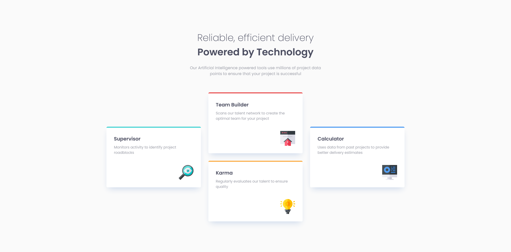

# Frontend Mentor - Four card feature section solution

This is a solution to the [Four card feature section challenge on Frontend Mentor](https://www.frontendmentor.io/challenges/four-card-feature-section-weK1eFYK). Frontend Mentor challenges help you improve your coding skills by building realistic projects. 

## Table of contents

- [Overview](#overview)
  - [The challenge](#the-challenge)
  - [Screenshot](#screenshot)
  - [Links](#links)
- [My process](#my-process)
  - [Built with](#built-with)
  - [What I learned](#what-i-learned)
  - [Useful resources](#useful-resources)
- [Author](#author)

## Overview

### The challenge

Users should be able to:

- View the optimal layout for the site depending on their device's screen size

### Screenshot



### Links

- Solution URL: [GitHub](https://github.com/mbdelarosa/four-card-feature-section)
- Live Site URL: [Four Card Feature Section](https://mbdelarosa.github.io/four-card-feature-section/)

## My process

### Built with

- Semantic HTML5 markup
- CSS custom properties
- Flexbox
- CSS Grid
- Mobile-first workflow

### What I learned

This challenge helped me better understand how to work with CSS Grid, specifically how to think and structure the grid layout for the desktop view. I feel like I was able to simplify my code by using the following:

```css
.section__cards {
  grid-template-columns: repeat(3, 1fr);
  grid-template-rows: repeat(4, 1fr);
  grid-auto-flow: column; /* To make the cards fill each column in turn, instead of filling per row */
}

/* Makes the cards span 2 rows by default */
.card {
  grid-row: span 2;
}

/* The Supervisor and Calculator cards are set to start in row 2 */
/* This also lets the second card Team Builder to start in column 2 without having to write more code */
.card--supervisor, .card--calculator {
  grid-row: 2 / span 2;
}
```

### Useful resources

- [Kevin Powell's "Learn CSS Grid the easy way" (Youtube)](https://www.youtube.com/watch?v=rg7Fvvl3taU&t=1651s&ab_channel=KevinPowell) - I always go back to this video tutorial because of their very good explanation and examples, in particular how to simplify the workflow when working with grids
- ["CSS grid-auto-flow Property" from W3Schools](https://www.w3schools.com/cssref/pr_grid-auto-flow.php) - Simple and understandable example of how the `grid-auto-flow` property behaves

## Author

- Frontend Mentor - [@mbdelarosa](https://www.frontendmentor.io/profile/mbdelarosa)